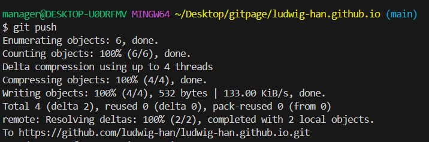

## test

무슨 내용을
---
아나
모르겠어
---
> 인용해볼까?
> 싫어.
실다고

애
&nbsp; 이거뭐냐고
이거 뭔데  </br>
아하 그렇군 지금부터 엔터 여러 번 간다.
됐냐? 안 되잖아 젠장

</br>
</br>
</br>
됏지? </br>

# 본문

- 리스트
- 리스트
- 리스트

```python
print('hello')
```

이러면 코드 완성~

```js
console.log('hi');
```

wow~
짱 쉬워요~
이러면  줄이 바뀌나?
안되잖아 </br> 이러면 되나?




이미지 첨부 짱 귀찮아요~  
이러면 엔터 된다?  
신기하네  
ㅋㅋ  
오케이  
</br>

---

</br>
하이~
